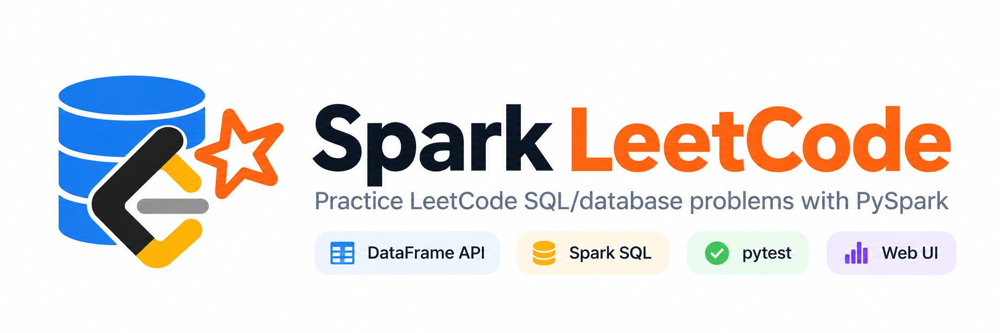
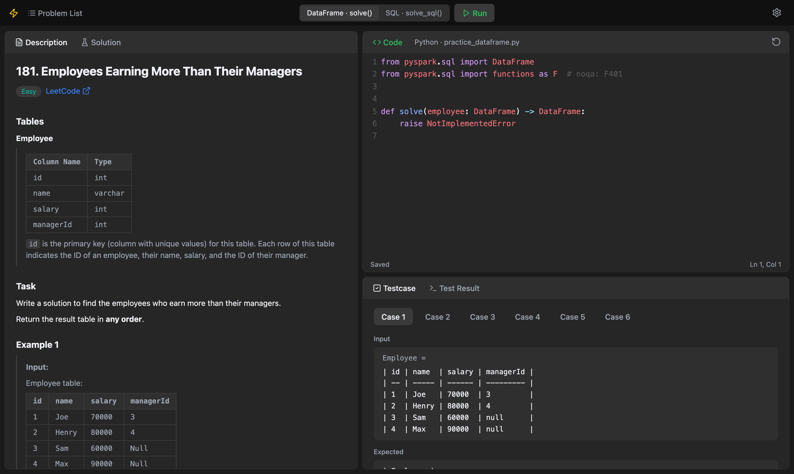

<picture>
  <source media="(prefers-color-scheme: dark)" srcset="docs/images/banner/dark_banner.png">
  <source media="(prefers-color-scheme: light)" srcset="docs/images/banner/light_banner.png">
  
</picture>

# Spark LeetCode

[](https://www.python.org/)
[](https://spark.apache.org/docs/latest/api/python/)
[](https://adoptium.net/)
[](https://docs.astral.sh/uv/)

Solve LeetCode SQL problems with Apache Spark, on your own computer.

LeetCode accepts answers to its database problems in SQL and Pandas, but not in PySpark.
If you want to learn Spark, this project gives you the same problems in PySpark.
You write your answer, click **Run**, and see the result in the same format as LeetCode: Accepted, Wrong Answer or Runtime Error.

##  Why this project

Users asked LeetCode for Spark support ([discussion](https://leetcode.com/discuss/general-discussion/3544154/pandas-polars-spark-on-leetcode/)), but LeetCode did not add it.
A possible cause: each Spark run starts a JVM (approximately 6 seconds, 1 GB of memory), which is expensive for an online judge.
On your own computer, this cost is small.

##  What you get

- LeetCode database problems, sorted by difficulty (easy, medium, hard).
- Two ways to solve each problem: the DataFrame API or Spark SQL. Do one or both.
- A local web page with the question, a code editor and the test results side by side.
- Extra test cases after the LeetCode example, for example empty tables and null values.
- A reference answer for each problem, if you get stuck.

##  How to start

1. Install the requirements and the project (see below).
2. Run `uv run python -m webui`.
3. Open <http://127.0.0.1:8000>, select a problem, write your code and click **Run**.

You can also use your own editor and run the tests from the terminal. See [Quick start without the web UI](#quick-start-without-the-web-ui).

##  How it works

Each problem has two blank practice files:

- `practice_dataframe.py`: write `solve()` with the DataFrame API.
- `practice_sql.py`: write `solve_sql()` with Spark SQL.

The two files are independent. An error in one file does not stop the tests of the other file.
The tests compare your output with the expected output.

##  Requirements

- Python 3.10 or later
- Java 17 or later (PySpark 4 needs it)
- [uv](https://docs.astral.sh/uv/)

##  Install

```bash
git clone https://github.com/arshia-naseri/spark_leetcode.git
cd spark_leetcode
uv sync
```

Use `uv` for all packages and commands. Do not use `pip`.

##  Web UI

The web UI is the main way to practice. Start it:

```bash
uv run python -m webui
```

The web UI opens at <http://127.0.0.1:8000>. It shows the list of problems and marks the solved methods.
Each problem opens in three panels: the question, a code editor with PySpark completions, and the test results.



Select `solve()` (DataFrame API) or `solve_sql()` (Spark SQL), write your code, and click **Run** (Ctrl/⌘ + Enter).
The editor saves your code automatically. A run takes approximately 6 seconds, because each run starts a new JVM.

##  Quick start without the web UI

To write code in your own editor and run the tests from the terminal:

1. Open a problem folder, for example `problems/easy/p0175_combine_two_tables/`.
2. Read `question.md`.
3. Write your answer in `practice_dataframe.py`, `practice_sql.py`, or both.
4. Run the tests:

   ```bash
   uv run pytest p0175
   ```

The first run makes the practice files from the templates. Git ignores the practice files.
A method that still raises `NotImplementedError` is skipped, not failed.

##  Common commands

```bash
uv run pytest                   # test your practice code (default)
uv run pytest --solution        # test the reference answers
uv run pytest --all             # run all tests
uv run pytest 175               # test one problem (number or folder name prefix)
uv run python reset.py p0175    # reset the practice files of one problem to the templates
```

Show the output of the LeetCode example:

```bash
uv run python -m problems.easy.p0175_combine_two_tables._internal.main            # your code
uv run python -m problems.easy.p0175_combine_two_tables._internal.main solution   # reference answer
```

Always run `main.py` as a module (`-m`) from the project root.

For the full list of commands, see [docs/commands.md](docs/commands.md).

##  Test reports

The tests ignore the order of rows and columns. The column names and the values must be the same.

- **Wrong Answer**: the report shows the Input, Output and Expected tables. Red shows extra columns or rows. Green shows missing columns or rows.
- **Runtime Error**: the report shows the first line of the error.
- **Correct**: pytest shows your output table in the "Output" section.

##  Spark settings

The default settings are in `common/spark.py` (`local[1]`, 1 shuffle partition, UI off, time zone UTC, 1g driver memory).
To change them, click the gear button in the web UI. The web UI writes `spark_config.json` in the project root.
The new settings apply to the next run.

##  Project layout

```text
spark_leetcode/
├── problems/
│   ├── easy/
│   │   └── p0175_combine_two_tables/
│   │       ├── question.md             # problem statement
│   │       ├── practice_dataframe.py   # your solve()      (git-ignored)
│   │       ├── practice_sql.py         # your solve_sql()  (git-ignored)
│   │       └── _internal/              # templates, reference answer, data, tests
│   ├── medium/
│   └── hard/
├── webui/                              # local web UI
├── common/                             # Spark session, answer check, practice file helpers
├── docs/                               # documentation
└── reset.py                            # resets practice files to the templates
```

##  Add a problem

In [Claude Code](https://claude.com/claude-code), run `/add-problem` with the problem URL or the problem slug:

```text
/add-problem https://leetcode.com/problems/<slug>/
/add-problem <slug>
```

Example:

```text
/add-problem https://leetcode.com/problems/second-highest-salary/
/add-problem second-highest-salary
```

The slug is the part of the URL after `/problems/`.

For the manual steps, see `CLAUDE.md`.
